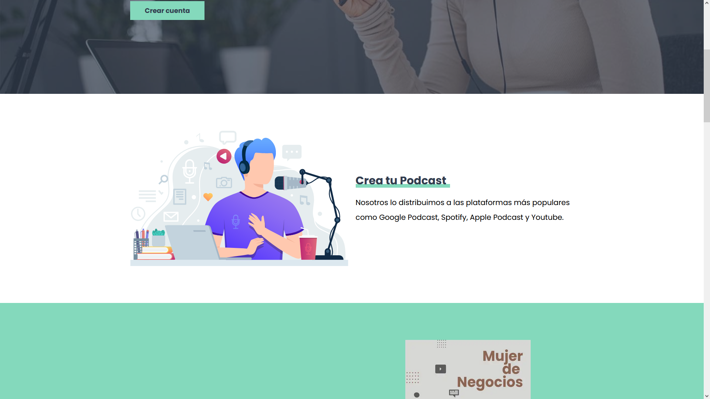
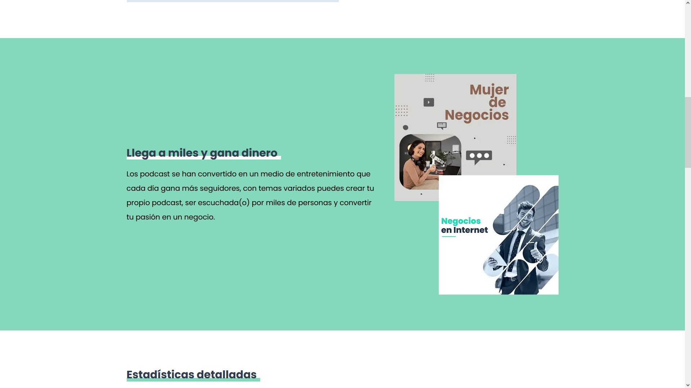
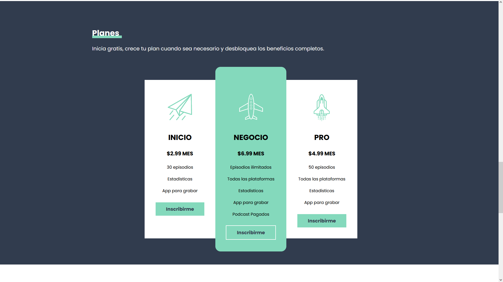
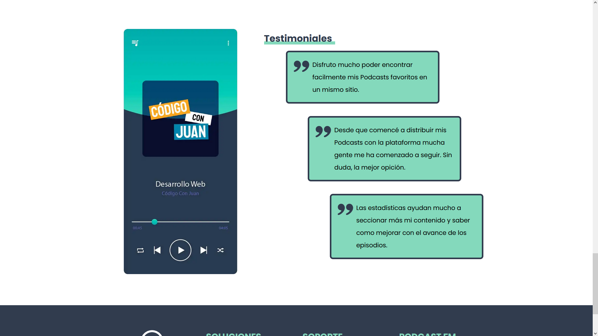
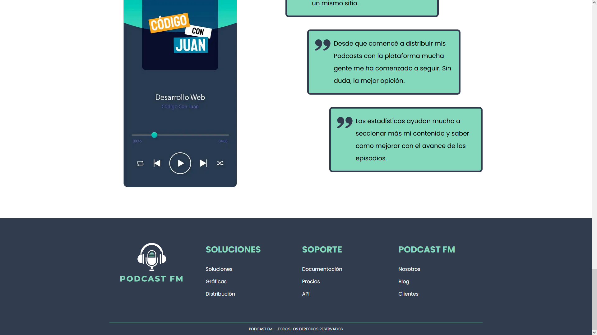
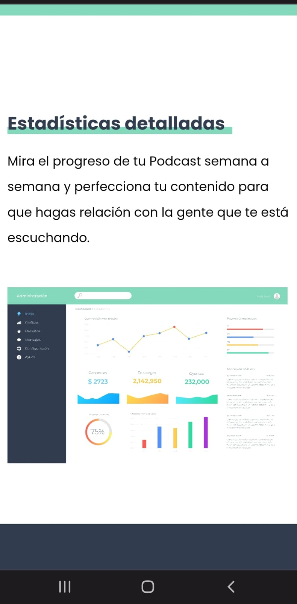
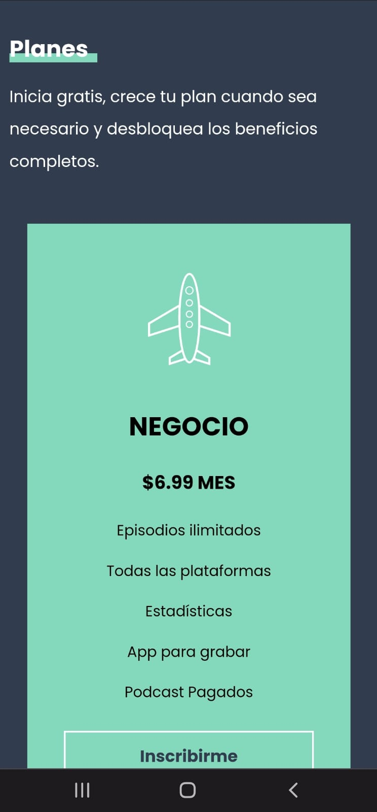
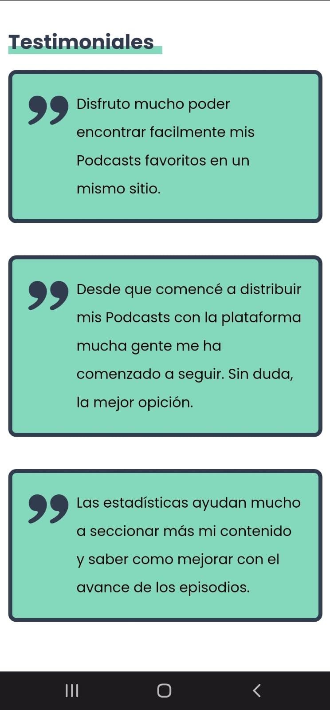
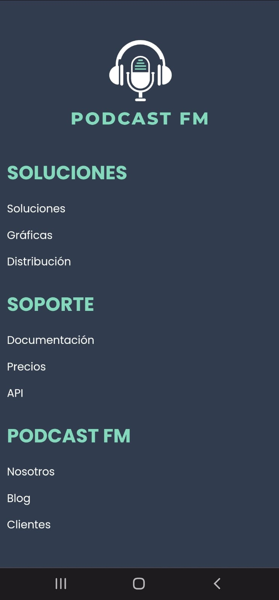

<h1>PodcastFM &mdash; Landing Page</h1>

<p>The current project is called "Podcast FM". This project is a landing page to promote a platform where you can distribute your podcasts. It has seven sections and it's completely responsive since it follows the mobile first principle. Different CSS methodologies were followed and semantic content is strongly stablished.</p>

<p>If you want to check it out, please enter in: </p>

```
https://podcastfmsrsn.netlify.app/
```
<br>

<h2>Technologies</h2>
<br>

<p>Different techonologies were used to developed this web page. However, the most important ones are: </p>

<ul style="list-style: square;">
<li>HTML5</li>
<li>CSS3</li>
<li>SASS</li>
<li>Gulp</li>
</ul>
<br>

<h2>Development Dependencies</h2>
<ul>
<li>sass</li>
<li>gulp-imagemin</li>
<li>gulp-webp</li>
<li>gulp-avif</li>
<li>gulp-sourcemaps</li>
<li>gulp-sass</li>
<li>gulp-postcss</li>
<li>autoprefixer</li>
<li>cssnano</li>
</ul>
<br>

<p>To install all of these dependencies, firstly execute: </p>

```
npm install
```

<p>Gulp were mainly used for image minimization, conversion image, compile scss code to css code, minization stylesheets css.</p>

<p>So, if you download this project to make any change and you want to apply those changes, it's a must to execute: </p>

```
gulp compile 
```

<p>This is a gulp tasks to compile scss code to css code.</p>
<br>

<h2>Sections</h2>
<br>

<h3>Desktop size</h3>
<br>
<div style="display: grid; grid-template-columns: repeat(2, 1fr); gap: 2rem;">







</div>
<br>

<h3>Phone size</h3>
<br>
<div style="display: grid; grid-template-columns: repeat(2, 1fr); gap: 2rem;">






</div>
<br>

